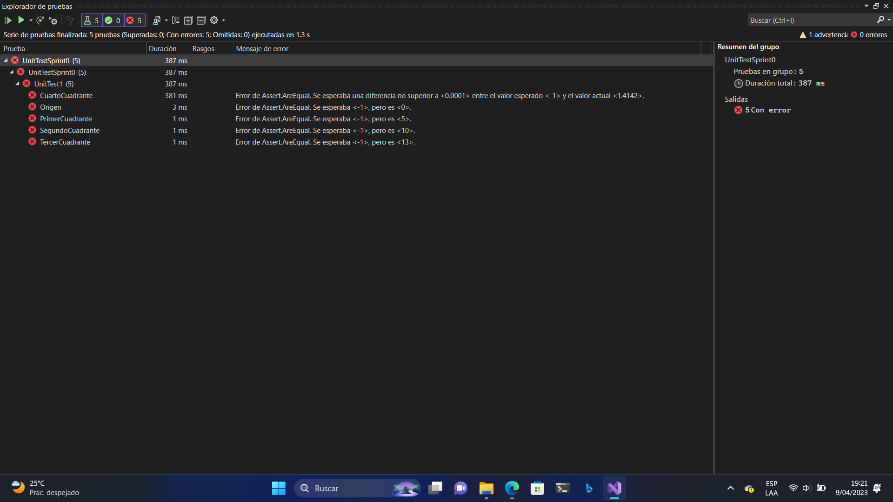
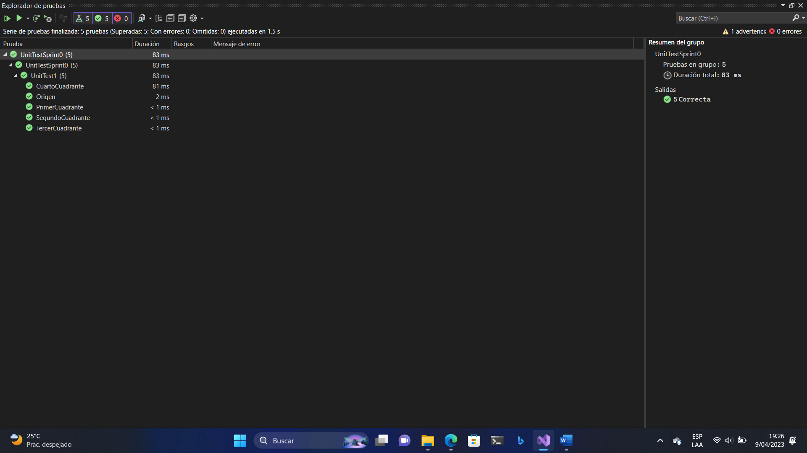
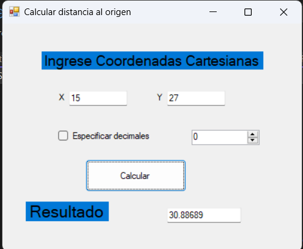
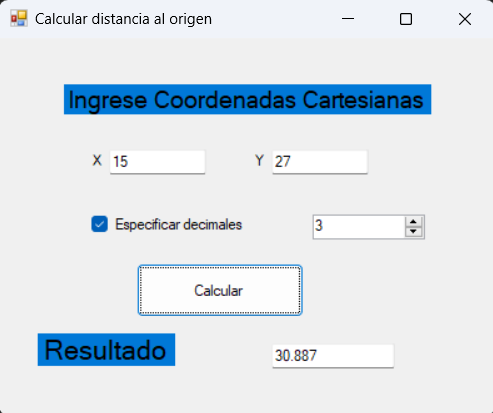

# Sprint 0

## 1. Decisiones claves para el proyecto SOS 
|  | Decision |
| -------- | -------- |
| Lenguaje de programación orientado a objetos | C# |
|Librería GUI  (recomendable) |	Windows Forms |
| IDE (Integrated Development Environment) |	Visual Studio Community 2022 |
| Framework  xUnit (JUnit for Java por ejemplo)	| MsTest (.NET Framework) |
| Guía de estilo de programación (debe ser leído con cuidado) |	Guía de estilo de C# Microsoft (Convensiones) |
| Sitio de alojamiento del proyecto | https://github.com/NaoDekoNeko/CC-3S2 |
| Otras decisiones si procede | |	

> Guía de estilo de C# Microsoft (Convenciones de código de C#): https://learn.microsoft.com/es-es/dotnet/csharp/fundamentals/coding-style/coding-conventions

## 2. Pruebas unitarias
### Codigo de los Tests
#### UnitTest1.cs
```C#
using Microsoft.VisualStudio.TestTools.UnitTesting;
using System;
using Sprint0;

namespace UnitTestSprint0
{
    [TestClass]
    public class UnitTest1
    {
        [TestMethod]
        public void Origen()
        {
                var distancia = new Distancia();
                var punto = new Coordenada(0, 0);
                var resultado = distancia.CalcularDistancia(punto);
                Assert.AreEqual(resultado, 0.0);
            
        }
        [TestMethod]
        public void PrimerCuadrante()
        {
            var distancia = new Distancia();
            var punto = new Coordenada(3, 4);
            var resultado = distancia.CalcularDistancia(punto);
            Assert.AreEqual(resultado, 5.0);
        }

        [TestMethod]
        public void SegundoCuadrante()
        {
            var distancia = new Distancia();
            var punto = new Coordenada(-6, 8);
            var resultado = distancia.CalcularDistancia(punto);
            Assert.AreEqual(resultado, 10.0);
        }

        [TestMethod]
        public void TercerCuadrante()
        {
            var distancia = new Distancia();
            var punto = new Coordenada(-12, -5);
            var resultado = distancia.CalcularDistancia(punto);
            Assert.AreEqual(resultado, 13.0);
        }

        [TestMethod]
        public void CuartoCuadrante()
        {
            var distancia = new Distancia();
            var punto = new Coordenada(1, -1);
            var resultado = distancia.CalcularDistancia(punto);
            Assert.AreEqual(resultado, 1.4142, 0.0001);
        }
    }
}
```
### Test en rojo
```C#
#### Distancia.cs
namespace Sprint0
{
    public class Distancia    {
        // Función que calcula la distancia de un punto al Origen
        public double CalcularDistancia(Coordenada punto)
        {
            return -1;

        }
    }
}
```


### Test en verde
#### Distancia.cs
```C#
namespace Sprint0
{
    public class Distancia    {
        // Función que calcula la distancia de un punto al Origen
        public double CalcularDistancia(Coordenada punto)
        {
            return Math.Sqrt(Math.Pow(punto.getX(), 2) + Math.Pow(punto.getY(), 2));

        }
    }
}
```


## 3. Programación
### GUI sin especificar decimales

### GUI con 3 decimales

### Código fuente
#### Form1.cs
```C#
using System;
using System.Collections.Generic;
using System.ComponentModel;
using System.Data;
using System.Drawing;
using System.Linq;
using System.Text;
using System.Threading.Tasks;
using System.Windows.Forms;

namespace Sprint0
{
    public partial class Form1 : Form
    {
        public Form1()
        {
            InitializeComponent();
        }
        private void button1_Click(object sender, EventArgs e)
        {
            //extraemos las coordenadas y las convertimos a double
            double X1 = Convert.ToDouble(textBox1.Text);
            double Y1 = Convert.ToDouble(textBox2.Text);

            //instanciamos las clases  
            var distancia = new Distancia();
            var coordenadas = new Coordenada(X1, Y1);
            var impri = new Imprimir();

            //variable que guarda el resultado en double
            var resultado = distancia.CalcularDistancia(coordenadas);
            //decision de cómo se mostrará (decimales a usar)
            //no se usó if inmediato (condition ? consecuente : alternativa)
            if (checkBox1.Checked)
                textBox5.Text = impri.Impresion(resultado, Convert.ToInt16(numericUpDown1.Value));
            else
                textBox5.Text = impri.Impresion(resultado);
        }
    }
}
```
### Form1.Designer.cs
```C#
namespace Sprint0
{
    partial class Form1
    {
        /// <summary>
        /// Variable del diseñador necesaria.
        /// </summary>
        private System.ComponentModel.IContainer components = null;

        /// <summary>
        /// Limpiar los recursos que se estén usando.
        /// </summary>
        /// <param name="disposing">true si los recursos administrados se deben desechar; false en caso contrario.</param>
        protected override void Dispose(bool disposing)
        {
            if (disposing && (components != null))
            {
                components.Dispose();
            }
            base.Dispose(disposing);
        }

        #region Código generado por el Diseñador de Windows Forms

        /// <summary>
        /// Método necesario para admitir el Diseñador. No se puede modificar
        /// el contenido de este método con el editor de código.
        /// </summary>
        private void InitializeComponent()
        {
            this.button1 = new System.Windows.Forms.Button();
            this.textBox1 = new System.Windows.Forms.TextBox();
            this.textBox2 = new System.Windows.Forms.TextBox();
            this.label2 = new System.Windows.Forms.Label();
            this.label4 = new System.Windows.Forms.Label();
            this.textBox5 = new System.Windows.Forms.TextBox();
            this.label6 = new System.Windows.Forms.Label();
            this.label3 = new System.Windows.Forms.Label();
            this.checkBox1 = new System.Windows.Forms.CheckBox();
            this.numericUpDown1 = new System.Windows.Forms.NumericUpDown();
            ((System.ComponentModel.ISupportInitialize)(this.numericUpDown1)).BeginInit();
            this.SuspendLayout();
            // 
            // button1
            // 
            this.button1.Location = new System.Drawing.Point(147, 222);
            this.button1.Name = "button1";
            this.button1.Size = new System.Drawing.Size(179, 53);
            this.button1.TabIndex = 1;
            this.button1.Text = "Calcular";
            this.button1.UseVisualStyleBackColor = true;
            this.button1.Click += new System.EventHandler(this.button1_Click);
            // 
            // textBox1
            // 
            this.textBox1.Location = new System.Drawing.Point(117, 109);
            this.textBox1.Name = "textBox1";
            this.textBox1.Size = new System.Drawing.Size(103, 22);
            this.textBox1.TabIndex = 2;
            // 
            // textBox2
            // 
            this.textBox2.Location = new System.Drawing.Point(291, 109);
            this.textBox2.Name = "textBox2";
            this.textBox2.Size = new System.Drawing.Size(103, 22);
            this.textBox2.TabIndex = 3;
            // 
            // label2
            // 
            this.label2.AutoSize = true;
            this.label2.Location = new System.Drawing.Point(96, 112);
            this.label2.Name = "label2";
            this.label2.Size = new System.Drawing.Size(15, 16);
            this.label2.TabIndex = 6;
            this.label2.Text = "X";
            // 
            // label4
            // 
            this.label4.AutoSize = true;
            this.label4.Location = new System.Drawing.Point(269, 112);
            this.label4.Name = "label4";
            this.label4.Size = new System.Drawing.Size(16, 16);
            this.label4.TabIndex = 8;
            this.label4.Text = "Y";
            // 
            // textBox5
            // 
            this.textBox5.Location = new System.Drawing.Point(291, 300);
            this.textBox5.Name = "textBox5";
            this.textBox5.Size = new System.Drawing.Size(131, 22);
            this.textBox5.TabIndex = 10;
            // 
            // label6
            // 
            this.label6.AutoSize = true;
            this.label6.BackColor = System.Drawing.SystemColors.Highlight;
            this.label6.Font = new System.Drawing.Font("Microsoft Sans Serif", 16.2F, System.Drawing.FontStyle.Regular, System.Drawing.GraphicsUnit.Point, ((byte)(0)));
            this.label6.Location = new System.Drawing.Point(41, 290);
            this.label6.Name = "label6";
            this.label6.Size = new System.Drawing.Size(143, 32);
            this.label6.TabIndex = 11;
            this.label6.Text = "Resultado";
            // 
            // label3
            // 
            this.label3.AutoSize = true;
            this.label3.BackColor = System.Drawing.SystemColors.Highlight;
            this.label3.Font = new System.Drawing.Font("Microsoft Sans Serif", 13.8F, System.Drawing.FontStyle.Regular, System.Drawing.GraphicsUnit.Point, ((byte)(0)));
            this.label3.Location = new System.Drawing.Point(69, 45);
            this.label3.Name = "label3";
            this.label3.Size = new System.Drawing.Size(379, 29);
            this.label3.TabIndex = 12;
            this.label3.Text = "Ingrese Coordenadas Cartesianas";
            // 
            // checkBox1
            // 
            this.checkBox1.AutoSize = true;
            this.checkBox1.Location = new System.Drawing.Point(99, 174);
            this.checkBox1.Name = "checkBox1";
            this.checkBox1.Size = new System.Drawing.Size(162, 20);
            this.checkBox1.TabIndex = 13;
            this.checkBox1.Text = "Especificar decimales";
            this.checkBox1.UseVisualStyleBackColor = true;
            // 
            // numericUpDown1
            // 
            this.numericUpDown1.Location = new System.Drawing.Point(335, 173);
            this.numericUpDown1.Maximum = new decimal(new int[] {
            9,
            0,
            0,
            0});
            this.numericUpDown1.Name = "numericUpDown1";
            this.numericUpDown1.Size = new System.Drawing.Size(120, 22);
            this.numericUpDown1.TabIndex = 14;
            // 
            // Form1
            // 
            this.AutoScaleDimensions = new System.Drawing.SizeF(8F, 16F);
            this.AutoScaleMode = System.Windows.Forms.AutoScaleMode.Font;
            this.ClientSize = new System.Drawing.Size(529, 372);
            this.Controls.Add(this.numericUpDown1);
            this.Controls.Add(this.checkBox1);
            this.Controls.Add(this.label3);
            this.Controls.Add(this.label6);
            this.Controls.Add(this.textBox5);
            this.Controls.Add(this.label4);
            this.Controls.Add(this.label2);
            this.Controls.Add(this.textBox2);
            this.Controls.Add(this.textBox1);
            this.Controls.Add(this.button1);
            this.Name = "Form1";
            this.Text = "Calcular distancia al origen";
            this.Load += new System.EventHandler(this.Form1_Load);
            ((System.ComponentModel.ISupportInitialize)(this.numericUpDown1)).EndInit();
            this.ResumeLayout(false);
            this.PerformLayout();

        }

        #endregion
        private System.Windows.Forms.Button button1;
        private System.Windows.Forms.TextBox textBox1;
        private System.Windows.Forms.TextBox textBox2;
        private System.Windows.Forms.Label label2;
        private System.Windows.Forms.Label label4;
        private System.Windows.Forms.TextBox textBox5;
        private System.Windows.Forms.Label label6;
        private System.Windows.Forms.Label label3;
        private System.Windows.Forms.CheckBox checkBox1;
        private System.Windows.Forms.NumericUpDown numericUpDown1;
    }
}
```
#### Imprimir.cs
```C#
using System;
using System.Collections.Generic;
using System.Linq;
using System.Text;
using System.Threading.Tasks;

namespace Sprint0
{
    public class Imprimir
    {
        //devuelve un string del numero con la cantidad de decimales seleccionados
        //devuelve 5 decimales si no se especifica
        public string Impresion(double numero, int decimales)
        {
            return numero.ToString("N"+decimales.ToString());
        }
        public string Impresion(double numero)
        {
            return numero.ToString("N5");
        }
    }
}
```

#### Distancia.cs
```C#
using System;
using System.Collections.Generic;
using System.Linq;
using System.Text;
using System.Threading.Tasks;

namespace Sprint0
{
    public class Distancia    {
        // Función que calcula la distancia de un punto al Origen
        public double CalcularDistancia(Coordenada punto)
        {
            return Math.Sqrt(Math.Pow(punto.getX(), 2) + Math.Pow(punto.getY(), 2));
        }
    }
}
```
